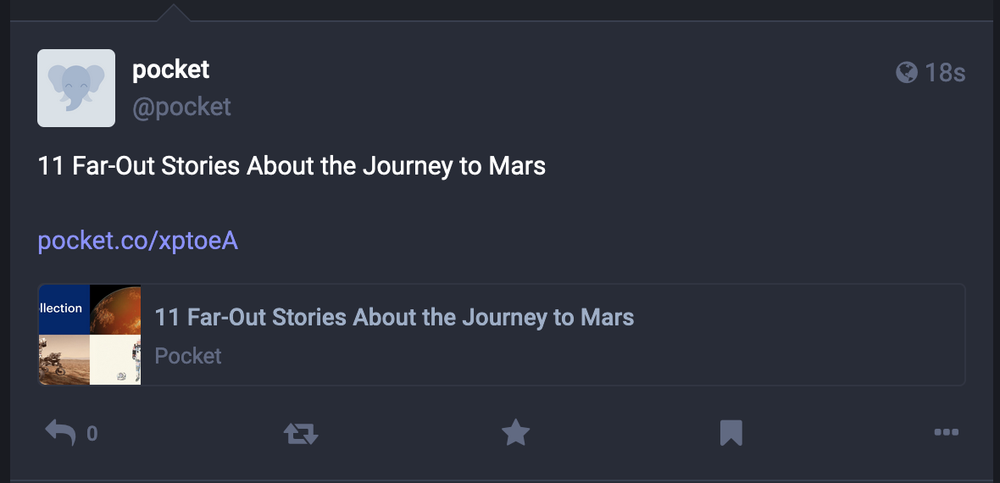

# Curation Bot

This project is a hackweek project for Mozilla.Social and is intended to take a random Collection from Pocket's GraphQL API and post it to a Mastodon Instance.

## Setup

1. Copy `.env.sample` to `.env`
2. Setup a Mastodon bot account.
   2a. 
   2b. 
   2c. 
3. Add the rest of the variables to `.env`
4. `npm i`
5. `npm run start` - this will pick a collection at random and post using provided credentials!

Note: there is no de-duplication, it may post the same one.

Note: This project does use short urls from the api, which is actively [discouraged](https://docs.joinmastodon.org/user/posting/#links) on Mastodon.
